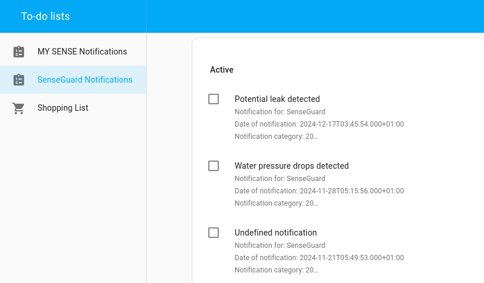
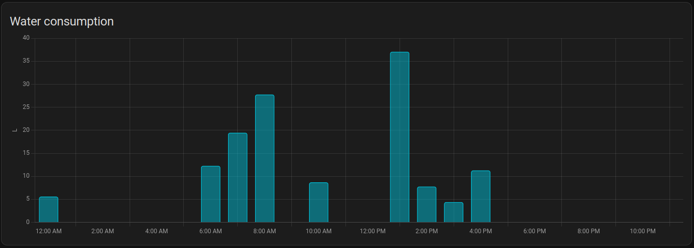
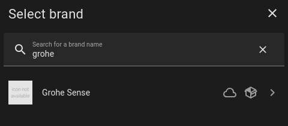
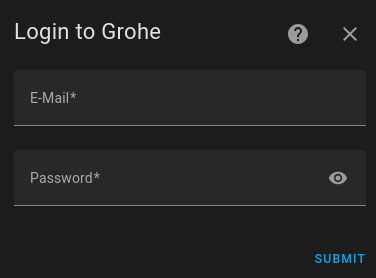
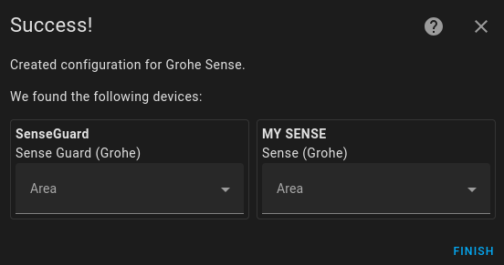

# Home Assistant - Grohe Smarthome (Sense and Blue)

Grohe Smarthome (Sense and Blue) integration for Home Assistant

This is an integration for all the Grohe Smarthome devices into Home Assistant. Namely, these are:
 - Grohe Sense (small leak sensor)
 - Grohe Sense Guard (main water pipe sensor/breaker)
 - Grohe Blue Home (water filter with carbonation)
 - Grohe Blue Professional (water filter with carbonation)

## Disclaimer
I am not affiliated with Grohe or the Grohe app in any way. 
If Grohe decides to change the API in any way, this could break the integration. 
Even though I'm testing the integration with my own devices, I am not liable for any potential issues, malfunctions, or damages arising from using this integration. 
Use at your own risk!

## Devices
Below is a list of supported devices.

### Grohe Sense
When you install this, you get the following sensors for Sense:
 - **Temperature**
 - **Humidity**
 - **Latest notification**

And the following diagnostic sensor:
 - **Battery**

It's a small, battery-powered device, so don't expect frequent updates. 
It seems to measure every hour, but the app also said it only uploads every 24h. 
The sensors I implemented only give the latest measurement returned from the server.

### Grohe Sense Guard 
When you install this, you get the following sensors for each Sense Guard:
 - **Consumption today** (as total increasing)
 - **Actual flow rate**
 - **Actual pressure** 
 - **Average daily consumption**
 - **Average monthly consumption**
 - **Latest consumption**
 - **Latest max flow rate**
 - **Temperature**
 - **Latest notification**

And the following diagnostic sensors:
 - **Online**
 - **Update available**
 - **Wifi quality**

You will also get a valve device called
 - **Valve**

The Sense Guard uploads data to its server every 15 minutes (at least the one I have), so don't expect to use this for anything close to real-time. 
For water withdrawals, it seems to report the withdrawal only when it ends, so if you continuously withdraw water, I guess those sensors may stay at 0. 
Hopefully, that would show up in the flow_rate sensor.

### Grohe Blue Home/Professional

When you install this, you get the following sensors for each Grohe Blue Home and Professional:
- **Cycles carbonated**
- **Cycles still**
- **Date cleaning**
- **Date CO2 replacement**
- **Date Filter replacement**
- **Time idle (max)**
- **Time operating**
- **Time pump running**
- **Time since last withdrawal**
- **Water running carbonated**
- **Water running medium**
- **Water running still**
- **Remaining CO2**
- **Remaining Filter**
- **Remaining CO2 total**
- **Remaining Filter total**
- **Latest notification**

And the following diagnostic sensors:
- **Count cleaning**
- **Count filter change**
- **Count Power cut**
- **Count pump**
- **Time since restart**
- **Time offset**
- **Update available**
- **Online**

### For all devices
All notifications from the devices are now listed in a todo list for each device

When setting them to be completed, they also set the appropriate notification in the events of the Grohe app as seen.

**HINT** Right now you need to refresh to see that the newly completed ones are also in the completed list of HA. I'm aware of this problem and will look into it.

If the API returns an unknown combination, it will be shown as `Unknown: Category %d, Type %d`. 
If you see that, please consider submitting a bug report with the following two information from the todo list `Notification category: %d, Notification subcategory: %d` description and additional some description of what it means.
This can be found by finding the corresponding notification in the Grohe Sense app.

## Automation ideas
- Turning water off when you're away (and dishwasher, washer, et.c. are not running) and turning it back on when home again.
- Turning water off when non-Grohe sensors detect water.
- Passing along notifications from Grohe sense to Slack/Matrix/Amazon (note that there is a polling delay, plus unknown delay between device and Grohe's cloud)
- Send notification when your alarm is armed away and flow rate is >0 (controlling for the high latency, plus dishwashers, ice makers, et.c.).

Graphing water consumption is also nice. Note: The data returned by Grohe's servers is extremely detailed.

## Energy dashboard
If a Sense Guard is installed, the water consumption sensor can be used to integrate into the energy dashboard.

## Actions
This integration also exposes a bunch of actions which can be used also in automations (or for debugging purposes).
The following Actions are available:
 - Grohe Sense and Blue: Get Dashboard Data
 - Grohe Sense and Blue: Get Appliance data
 - Grohe Sense and Blue: Get Appliance details
 - Grohe Sense and Blue: Get Appliance status
 - Grohe Sense and Blue: Get Appliance pressure measurements
 - Grohe Sense and Blue: Get Appliance notifications
 - Grohe Sense and Blue: Get Profile notifications
 - Grohe Sense and Blue: Get Appliance command
 - Grohe Sense and Blue: Set Appliance command
 - Grohe Sense and Blue: Set Snooze
 - Grohe Sense and Blue: Tap Water

## Installation

### Step 1: Download the files

#### Option 1: Via HACS
- Make sure you have HACS installed. If you don't, run `curl -sfSL https://hacs.xyz/install | bash -` in Home Assistant.
- Choose Integrations under HACS. Click the '+' button on the bottom of the page, search for 
  "Grohe Sense", choose it, and click install in HACS.

At the moment it is not directly listed in HACS (PR is open) and therefore you have to take additional steps:
1. Open the HACS panel in your Home Assistant frontend.
2. Navigate to the "Integrations" tab.
3. Click the three dots in the top-right corner and select "Custom Repositories."
4. Add a new custom repository:
    - URL: https://github.com/Flo-Schilli/ha-grohe_smarthome
    - Category: Integration
5. Click "Save" and then click "Install" on the Grohe Sense integration.
6. Then, restart your HomeAssistant Instance and go to Settings -> Devices & Services -> Add Integration and search for "Grohe Sense".
7. Enter your Grohe credentials and click on "Submit".

#### Option 2: Manual
- Clone this repository or download the source code as a zip file and add/merge the `custom_components/` folder with its contents in your configuration directory.

### Step 2: Login

#### Via config flow
The component supports the config flow of home assistant. 

After you have added the component and restarted home assistant, you can search for 'Grohe Smarthome':

After selecting the component you can enter your credentials (username/password):

If everything went well, you get a list of all your found devices, and you can assign them to an area (new or existing):

When you've clicked on finish the devices are added to home assistant and can be managed via UI.

## Remarks on the "API"
I have not seen any documentation from Grohe on the API this integration is using, so likely it was only intended for their app.
Breaking changes have happened previously, and can easily happen again.
I try to always keep the integration updated to their latest API.

The API returns _much_ more detailed data than is exposed via these sensors.
For withdrawals, it returns an exact start- and end time for each withdrawal, as well as volume withdrawn.
It seems to store data since the water meter was installed, so you can extract a lot of historic data (but then polling gets a bit slow).
I'm not aware of any good way to expose time series data like this in home assistant (suddenly I learn that 2 liters was withdrawn 5 minutes ago, and 5 liters was withdrawn 2 minutes ago).
If anyone has any good ideas/pointers, that'd be appreciated.

## Credits
Thanks to:
 - [gkreitz](https://github.com/gkreitz/homeassistant-grohe_sense) for the initial implementation of the Grohe Sense
 - [rama1981](https://github.com/rama1981) for reaching out and going through the trial and error for the Grohe Blue Professional.
 - [daxyorg](https://github.com/daxyorg) for going through the trial and error of the refactored version and testing with Grohe Blue Home.
 - [windkh](https://github.com/windkh/node-red-contrib-grohe-sense) from whom I've token a lot of the notification types available.
 - [FlorianSW](https://github.com/FlorianSW/grohe-ondus-api-java) for the initial protocol understanding